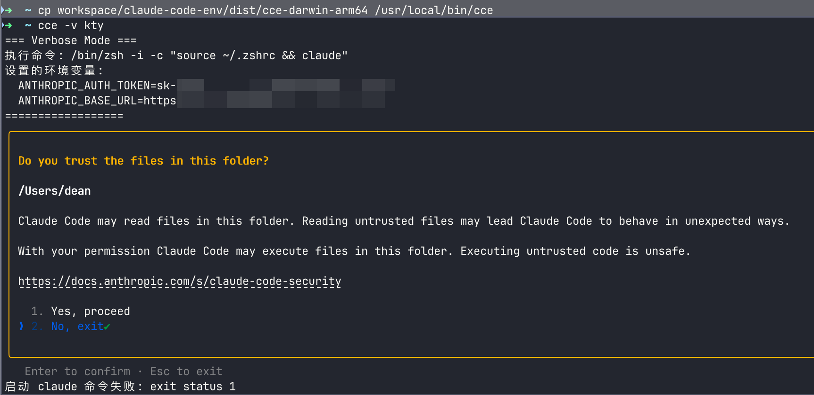

# CLAUDE-CODE-ENV

[](https://github.com/underthestar2021/claude-code-env/actions/workflows/build.yml)
[](https://opensource.org/licenses/MIT)
[](https://golang.org/)
[](https://github.com/underthestar2021/claude-code-env/releases/latest)

本项目是一个 Golang 版本的 Claude Code 启动器，用于快速切换不同的 Claude API 配置。

## 🚀 快速开始

### 1. 使用步骤

**基本用法**：
```bash
# 启动指定服务配置
cce service-name

# 详细模式（显示执行信息）
cce -v service-name
```

**实际运行效果**：



*上图展示了 `cce -v kty` 命令的实际运行效果，包括详细的环境变量设置和 Claude Code 的安全提示界面。*

### 2. 配置管理

**自动配置**：
首次运行时，程序会自动引导您创建配置文件 `~/.claude-code-env/settings.json`

**配置文件格式**：
```json
{
    "service-name1": {
        "ANTHROPIC_BASE_URL": "https://service1.example.com",
        "ANTHROPIC_AUTH_TOKEN": "sk-your-token-1"
    },
    "service-name2": {
        "ANTHROPIC_BASE_URL": "https://service2.example.com",
        "ANTHROPIC_API_KEY": "sk-your-token-2",
        "ANTHROPIC_MODEL": "claude-3-sonnet"
    }
}
```

### 3. 安装说明

**下载预编译版本**：
前往 [Releases 页面](https://github.com/underthestar2021/claude-code-env/releases/latest) 下载对应平台版本，重命名为 `cce` 并添加到系统 PATH。

**或构建安装**：
```bash
git clone https://github.com/underthestar2021/claude-code-env.git
cd claude-code-env
./build.sh  # 构建当前平台版本
sudo cp dist/cce /usr/local/bin/
```

---

## 📖 详细文档

### 功能特性

- 🔧 支持多个 Claude API 服务配置
- 🚀 快速启动不同配置的 Claude Code
- 📝 自动配置文件创建和管理
- 🔍 详细模式（verbose）显示执行信息
---

## 📖 详细文档

### 完整安装指南

#### 方法1：使用构建脚本（推荐）

1. 确保已安装 Go 1.21 或更高版本
2. 使用构建脚本编译：

```bash
# 为当前系统编译
./build.sh

# 编译所有支持的平台
./build.sh all

# 只编译 Linux 版本（适用于部署到服务器）
./build.sh linux

# 只编译 macOS 版本
./build.sh darwin

# 只编译 Windows 版本  
./build.sh windows
```

构建完成后，可执行文件位于 `dist/` 目录：
- `cce-darwin-amd64` - macOS Intel
- `cce-darwin-arm64` - macOS Apple Silicon
- `cce-linux-amd64` - Linux 64位
- `cce-windows-amd64.exe` - Windows 64位

3. 将对应平台的可执行文件复制到系统 PATH：

```bash
# macOS/Linux
sudo cp dist/cce-linux-amd64 /usr/local/bin/cce

# 或者添加到用户目录
cp dist/cce-linux-amd64 ~/.local/bin/cce
```

#### 方法2：手动编译

1. 确保已安装 Go 1.21 或更高版本
2. 直接编译项目：

```bash
# 为当前系统编译
go build -o cce ./cmd/cce

# 交叉编译到 Linux（在 macOS 上执行）
GOOS=linux GOARCH=amd64 go build -o cce-linux ./cmd/cce
```

3. 将可执行文件添加到系统 PATH：

```bash
sudo cp cce /usr/local/bin/
```

### 详细配置说明

#### 配置文件位置
配置文件：`~/.claude-code-env/settings.json`

#### 自动配置创建
首次运行时，如果配置文件不存在，程序会询问是否创建：

```bash
./cce service-name
```

程序会询问是否创建 `~/.claude-code-env/settings.json` 配置文件

#### 手动配置

配置文件格式：
```json
{
    "service-name1": {
        "ANTHROPIC_BASE_URL": "https://service1.example.com",
        "ANTHROPIC_AUTH_TOKEN": "sk-your-token-1"
    },
    "service-name2": {
        "ANTHROPIC_BASE_URL": "https://service2.example.com",
        "ANTHROPIC_API_KEY": "sk-your-token-2",
        "ANTHROPIC_MODEL": "claude-3-sonnet"
    }
}
```

### 使用方法详解

#### 基本用法
```bash
# 使用指定的服务配置启动 Claude Code
cce service-name

# 查看可用的服务配置
cce

# 详细模式（显示执行的命令和环境变量）
cce --verbose service-name
cce -v service-name
cce service-name -v
```

## 操作流程

1. **配置文件检查**：程序首先检查 `~/.claude-code-env/settings.json` 是否存在
2. **自动创建**：如果配置文件不存在，询问用户是否创建目录和配置文件
3. **参数验证**：验证命令行参数格式和服务名称
4. **环境变量设置**：根据配置设置相应的环境变量
5. **启动 Claude**：通过 shell 执行 `claude` 命令，支持 alias

## 环境变量支持

程序支持以下 Claude Code 环境变量：
- `ANTHROPIC_BASE_URL` - API 基础 URL
- `ANTHROPIC_AUTH_TOKEN` - 认证 Token
- `ANTHROPIC_API_KEY` - API Key（与 AUTH_TOKEN 二选一）
- `ANTHROPIC_MODEL` - 指定模型
- 以及其他 `ANTHROPIC_*` 开头的环境变量

## 兼容性

- ✅ 支持 macOS、Linux
- ✅ 支持 bash、zsh、fish 等 shell
- ✅ 兼容 Claude Code shell alias
- ✅ 支持交互式和非交互式使用

## 故障排除

### Claude 命令未找到
确保 Claude Code 已正确安装并可通过命令行访问：
```bash
which claude
claude --version
```

### 配置文件问题
检查配置文件格式和权限：
```bash
cat ~/.claude-code-env/settings.json
ls -la ~/.claude-code-env/
```

### 环境变量未生效
使用详细模式检查环境变量是否正确设置：
```bash
cce -v your-service-name
```

## 开发

项目结构：
```
claude-code-env/
├── cmd/
│   └── cce/
│       └── main.go          # 主程序入口
├── internal/
│   ├── config/
│   │   ├── config.go        # 配置管理
│   │   ├── creator.go       # 配置文件创建
│   │   └── config_test.go   # 配置测试
│   └── executor/
│       └── executor.go      # 命令执行器
├── .github/
│   └── workflows/
│       └── build.yml        # GitHub Actions 工作流
├── go.mod                   # Go 模块定义
├── build.sh                 # 多平台构建脚本
├── README.md                # 项目文档
├── LICENSE                  # 许可证
├── settings.json.example    # 配置文件示例
└── dist/                    # 构建输出目录
    ├── cce-darwin-amd64
    ├── cce-darwin-arm64
    ├── cce-linux-amd64
    └── cce-windows-amd64.exe
```

### 构建和测试

```bash
# 本地测试
go run ./cmd/cce service-name

# 运行测试
go test -v ./...

# 构建所有平台
./build.sh all

# 只构建 Linux 版本
./build.sh linux

# 清理构建文件
./build.sh clean

# 查看构建脚本帮助
./build.sh help
```

## 贡献

欢迎贡献代码！请遵循以下步骤：

1. Fork 本仓库
2. 创建特性分支：`git checkout -b feature/amazing-feature`
3. 提交更改：`git commit -m 'Add amazing feature'`
4. 推送到分支：`git push origin feature/amazing-feature`
5. 提交 Pull Request

### 开发环境

- Go 1.21+
- Git

### CI/CD

本项目使用 GitHub Actions 进行持续集成：

- **自动测试**：每次 Push 和 PR 都会运行测试
- **多平台构建**：自动构建 macOS、Linux、Windows 版本
- **自动发布**：Git 标签推送时自动创建 GitHub Release

创建新版本：
```bash
git tag -a v1.0.0 -m "Release v1.0.0"
git push origin v1.0.0
```

## 问题反馈

如遇到问题或有功能建议，请：

1. 查看 [Issues 页面](https://github.com/underthestar2021/claude-code-env/issues) 是否有类似问题
2. 如没有，请 [创建新 Issue](https://github.com/underthestar2021/claude-code-env/issues/new)
3. 提供详细的问题描述和复现步骤

## 更新日志

查看 [Releases 页面](https://github.com/underthestar2021/claude-code-env/releases) 了解版本更新历史。

## 许可证

本项目采用 MIT 许可证。
